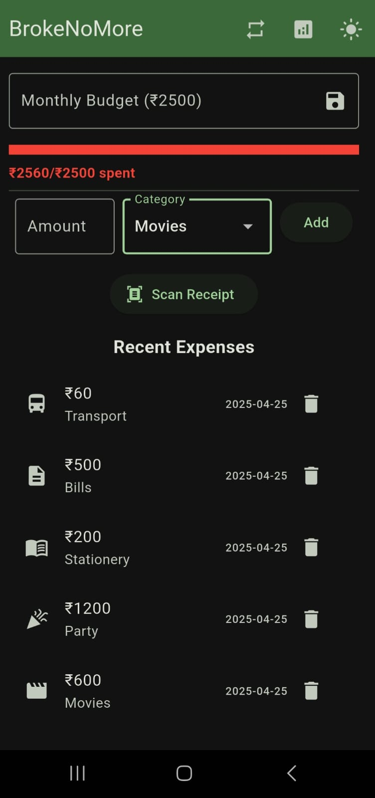
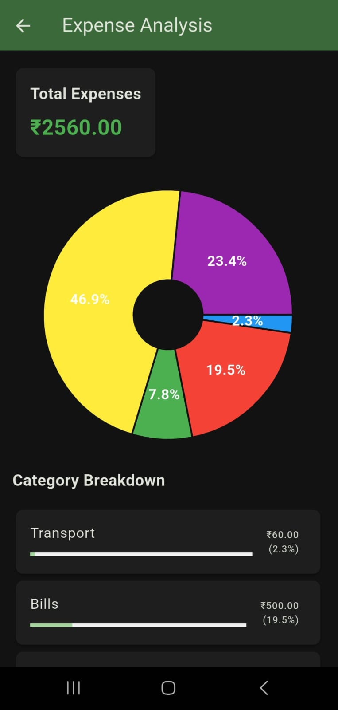
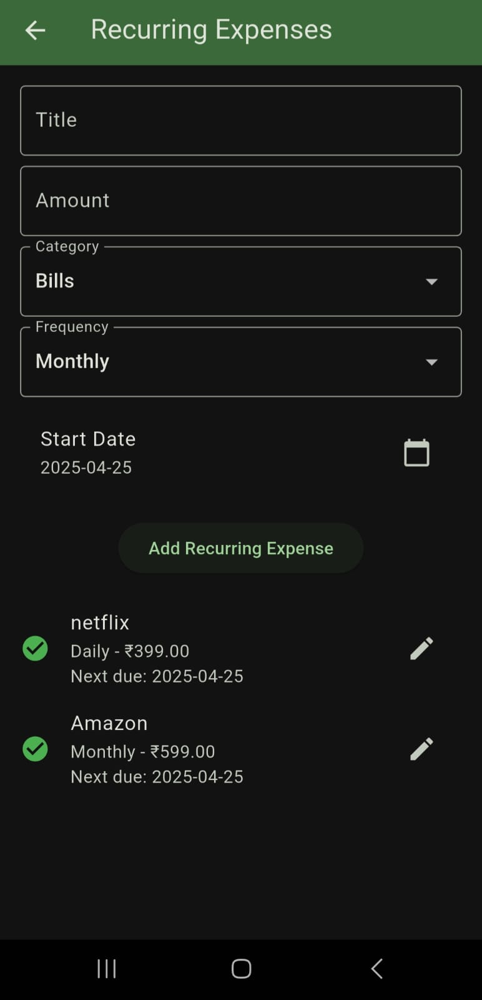
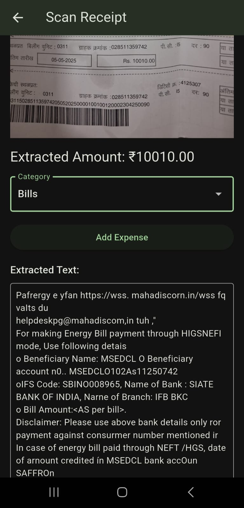

# BrokeNoMore - Student Expense Tracker

A Flutter-based expense tracking application designed specifically for students to manage their finances effectively.

## Features

### Core Features
- **Budget Management**: Set and track monthly budget with visual progress indicators and real-time updates
- **Receipt Scanning**: Scan receipts using device camera with automatic amount extraction using OCR
- **Expense Analysis**: Visual pie chart showing expense distribution and category-wise breakdown

### Additional Features
- Add, edit, and delete expenses
- Categorize expenses (Food, Transport, Movies, Party, Stationery, Bills)
- View expense history
- Manage recurring expenses (Daily, Weekly, Monthly)
- Track upcoming payments
- Dark/Light theme support

## Screenshots

### Main Dashboard

*Home screen showing budget progress and recent expenses*

### Expense Analysis

*Pie chart and category-wise breakdown of expenses*

### Recurring Expenses

*Manage recurring expenses and their schedules*

### Receipt Scanner

*Scan and extract expenses from receipts*

## Technical Details

### Dependencies
- Flutter SDK: >=3.1.3 <4.0.0
- hive: ^2.2.3 (Local storage)
- hive_flutter: ^1.1.0 (Flutter bindings for Hive)
- provider: ^6.0.5 (State management)
- google_mlkit_text_recognition: ^0.11.0 (OCR for receipt scanning)
- image_picker: ^1.0.4 (Camera and gallery access)
- fl_chart: ^0.63.0 (Charts and graphs)
- uuid: ^4.2.1 (Unique ID generation)
- shared_preferences: ^2.2.2 (Settings storage)

### Architecture
- Uses Provider for state management
- Hive for local data persistence
- Material Design 3 components
- Responsive layout design

## Getting Started

1. Clone the repository
2. Run `flutter pub get` to install dependencies
3. Run `flutter run` to start the app
